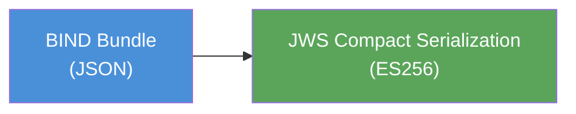
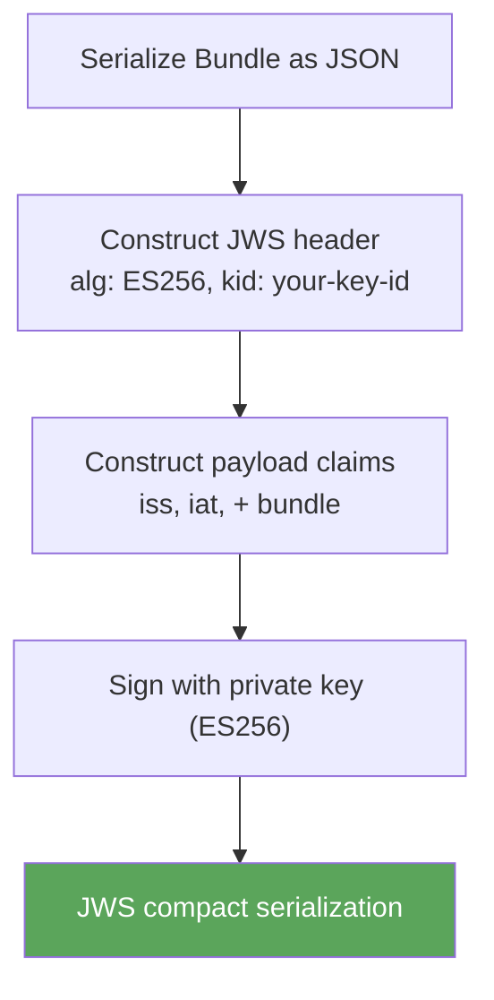
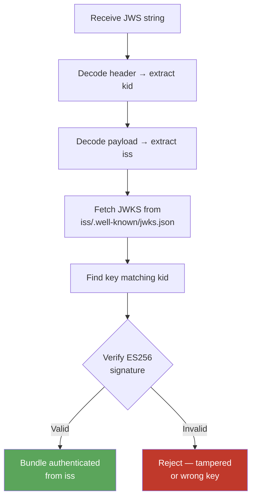

# Signed Bundles

A **Signed Bundle** is a BIND Bundle wrapped in a JWS (JSON Web Signature) compact serialization. It proves that the bundle was created by a specific organization and has not been tampered with.

Signing is optional — unsigned bundles are valid BIND data. But signed bundles enable trust: a recipient can verify the signature against the signer's public key, published in the [BIND Directory](https://bindpki.org).

## Overview



The result is a string with three base64url-encoded segments separated by dots:

```
<header>.<payload>.<signature>
```

Any system that receives a signed bundle can verify it by fetching the signer's public keys from the BIND Directory — no prior relationship or shared secret required.

## Signing Specification

Signed bundles use **ES256** (ECDSA with P-256 and SHA-256) with JWKS-based key discovery via the [BIND Directory](/trust).

### JWS Header

| Field | Value | Description |
|-------|-------|-------------|
| `alg` | `ES256` | ECDSA with P-256 curve and SHA-256 |
| `kid` | `<key-id>` | Key ID matching a key in the signer's JWKS |

### JWS Payload Claims

| Claim | Type | Description |
|-------|------|-------------|
| `iss` | string | Issuer URL — the signer's base URL in the BIND Directory (e.g. `https://bindpki.org/egr`). JWKS is discovered at `{iss}/.well-known/jwks.json`. |
| `iat` | number | Issued-at time (seconds since Unix epoch) |
| `nbf` | number? | Not before — bundle should not be accepted before this time |
| `exp` | number? | Expiration — bundle should not be accepted after this time |

The JWS payload body is the BIND Bundle JSON. Together with the claims, a signed bundle asserts: *"This bundle was created by `iss` at time `iat`."*

### Algorithm

Only **ES256** is supported. This keeps the ecosystem uniform and verifiable — all participants in the BIND Directory publish EC P-256 keys.

RSA and other algorithms are intentionally excluded.

## Signing a Bundle



### Example (pseudocode)

```js
import { SignJWT } from "jose";

const bundle = { resourceType: "Bundle", type: "document", entry: [...] };

const jws = await new SignJWT(bundle)
  .setProtectedHeader({ alg: "ES256", kid: "<your-key-id>" })
  .setIssuer("https://bindpki.org/<your-slug>")
  .setIssuedAt()
  .sign(privateKey);
```

The output `jws` is a string like `eyJhbGci...` that can be transmitted, stored, or encrypted for exchange.

## Verifying a Signed Bundle

Verification requires no prior trust relationship — only access to the BIND Directory.



### Example (pseudocode)

```js
import { jwtVerify, createRemoteJWKSet } from "jose";

// iss is the full issuer URL, e.g. "https://bindpki.org/egr"
const JWKS = createRemoteJWKSet(
  new URL(`${iss}/.well-known/jwks.json`)
);

const { payload } = await jwtVerify(jws, JWKS, {
  algorithms: ["ES256"],
  issuer: iss,
});

// payload contains the verified BIND Bundle + claims
```

### Verification checks

| Check | Action |
|-------|--------|
| `kid` not found in JWKS | Reject — key unknown or revoked |
| Signature invalid | Reject — tampered or wrong key |
| `iss` not in BIND Directory | Reject — unknown issuer |
| `exp` in the past | Reject — bundle has expired |
| `nbf` in the future | Reject — bundle not yet valid |
| Key `exp` in the past | Warn — signing key has expired (may still be valid for historical verification) |

## Key Discovery

Signer public keys are published in the **BIND Directory** at [bindpki.org](https://bindpki.org). The `iss` claim is the signer's base URL in the directory:

```
iss = https://bindpki.org/{slug}
```

The JWKS is discovered by appending `/.well-known/jwks.json`:

```
{iss}/.well-known/jwks.json
→ https://bindpki.org/{slug}/.well-known/jwks.json
```

The JWKS follows [RFC 7517](https://datatracker.ietf.org/doc/html/rfc7517) format. Keys use EC P-256 with optional lifecycle fields (`iat`, `nbf`, `exp`). The `kid` is an [RFC 7638](https://datatracker.ietf.org/doc/html/rfc7638) JWK Thumbprint (SHA-256, base64url).

See the [BIND Directory](/trust) for how organizations register and manage their keys.

## Signed vs. Unsigned

| | Signed | Unsigned |
|---|--------|----------|
| **Format** | JWS compact serialization | Raw JSON |
| **Authenticity** | Verifiable — issuer proven via BIND Directory | None — origin unknown |
| **Integrity** | Tamper-evident — signature breaks if modified | None |
| **Exchange tier** | Trusted (5 MB, 72h–1 year expiry) | Untrusted (10 KB, 1h expiry) |
| **Use cases** | Official submissions, bound policies, certificates | Draft data, internal transfers, testing |

## Relationship to BIND Exchange

[BIND Exchange](/exchange) uses signed bundles as part of its protocol:

1. **Bundle JWS** (Layer 1) — The signed bundle as described on this page
2. **JWE encryption** (Layer 2) — The signed bundle is encrypted for confidential transfer
3. **Proof JWT** (Layer 3) — A separate JWT proving trust to the exchange server

Signed bundles can also be used **outside of Exchange** — stored in databases, attached to emails, embedded in API responses, or published on websites. The signature is self-contained and verifiable anywhere.
