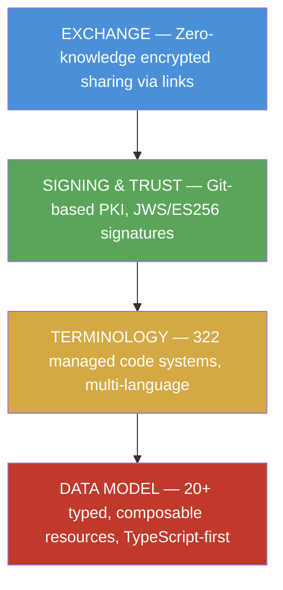
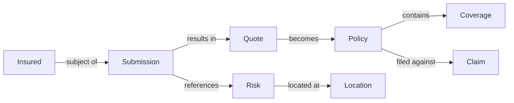
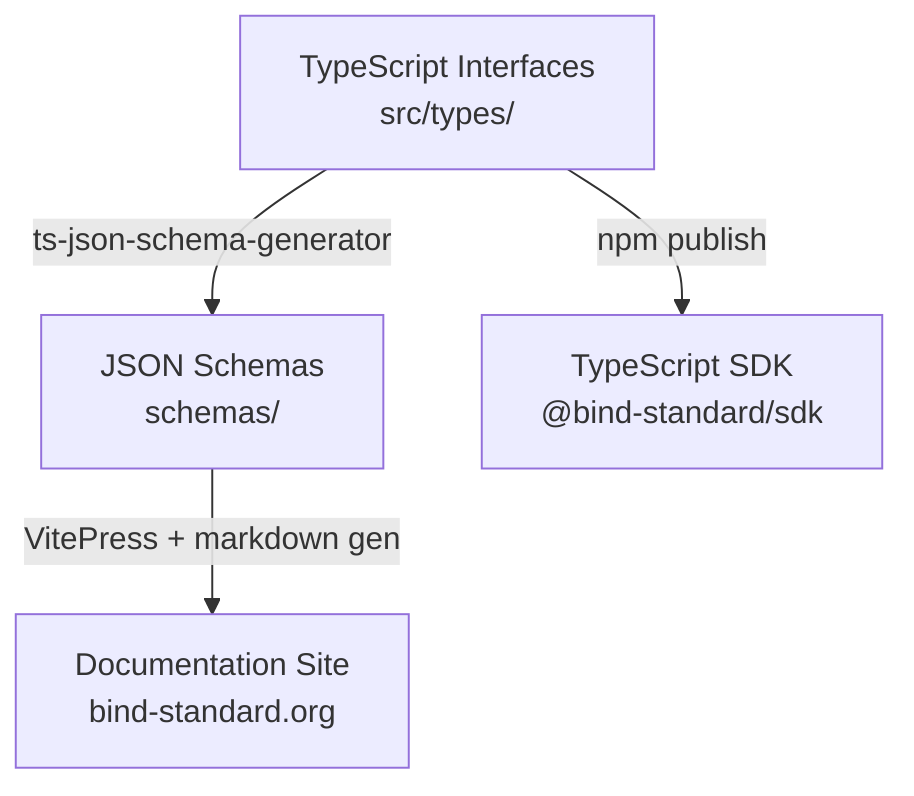
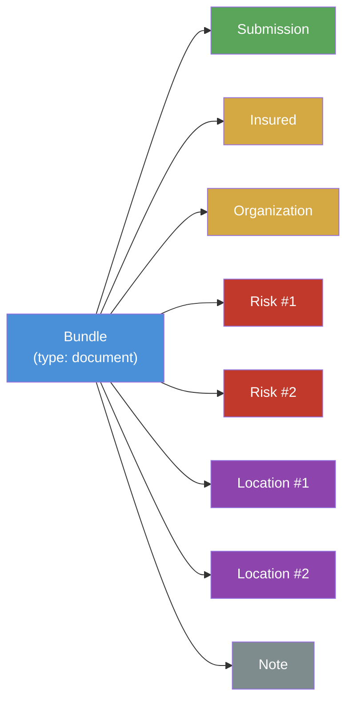
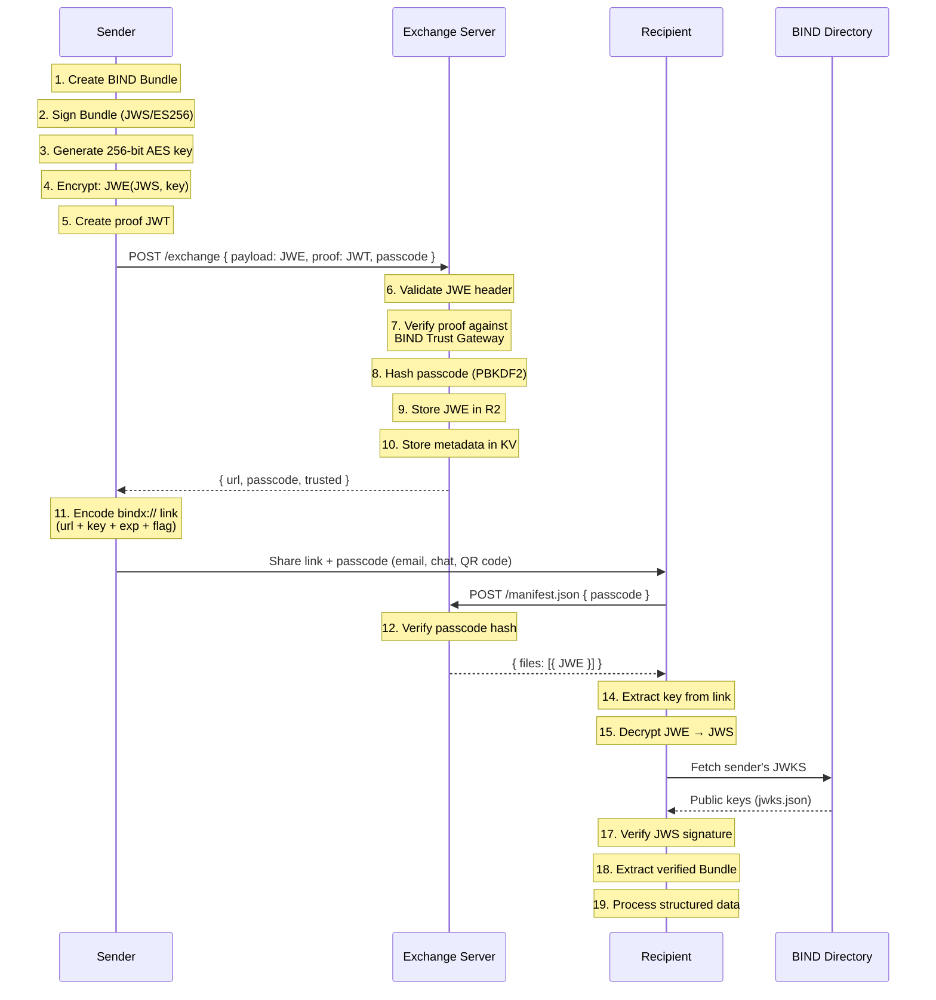

# BIND: Business Insurance Normalized Data

## An Open Data Interoperability Standard for Insurance

**Version 1.0 — February 2026**


## 1. Abstract

Insurance is one of the last major financial sectors without a universal data interchange standard. Every day, submissions are re-keyed across systems, integrations are built bespoke for each carrier, and data quality degrades at every handoff. The industry spends billions annually on data friction that adds zero value to the risk transfer itself.

**BIND** (Business Insurance Normalized Data) is an open, public-domain data standard that defines a common language for exchanging insurance information between brokers, carriers, MGAs, TPAs, reinsurers, and technology vendors. It provides a universal set of composable resource types — Submission, Quote, Policy, Coverage, Claim, Insured, Organization, Location, and more — with strongly typed data structures, a managed terminology layer of over 320 code systems, and a built-in trust and exchange protocol that enables cryptographically verified, encrypted data sharing without requiring a shared platform.

BIND explicitly adopts the architecture and design patterns of HL7 FHIR (Fast Healthcare Interoperability Resources), which solved an identical fragmentation problem in healthcare and created a multi-billion-dollar interoperability ecosystem within a decade. This white paper provides a comprehensive technical and business justification for the standard, covering its data model, trust infrastructure, exchange protocol, developer tooling, and path to adoption.

The standard is published under a CC0 (public domain) license, is fully open-source on GitHub, and is positioned to become a vendor-neutral, community-governed initiative.


## 2. The Interoperability Crisis in Insurance

### 2.1 The Current State of Insurance Data Exchange

The insurance industry operates on a foundation of manual, document-centric data exchange that has resisted modernization for decades. While adjacent financial sectors — banking, payments, securities — have adopted machine-readable interchange standards (ISO 20022, FIX Protocol, FpML), insurance continues to rely on processes that would be recognizable to an underwriter from the 1990s.

Consider the lifecycle of a single commercial insurance submission:

1. A broker gathers risk information from the insured, often via PDF applications, emailed spreadsheets, and phone calls.
2. The broker enters this data into their Broker Management System (BMS).
3. To submit to Carrier A, the broker exports or re-enters the data into Carrier A's proprietary portal.
4. To submit to Carrier B, the broker repeats the process with a different portal, different field names, and different required formats.
5. Carrier A's underwriter receives the submission and re-enters key data into their underwriting workbench.
6. When the carrier issues a quote, the broker re-enters the quoted terms back into the BMS.
7. Upon binding, the policy data is re-entered yet again — sometimes by both parties.
8. At claim time, the same information is re-entered into claims systems, often from the original PDF documents.

A single commercial submission can be re-entered five or more times as it moves from broker to carrier to MGA and back. Each re-entry introduces the possibility of error, delay, and data loss.

### 2.2 The Cost of Data Friction

The consequences of this fragmentation are measured in billions of dollars annually across the industry:

**Integration costs.** Every brokerage maintains dozens of one-off API integrations and portal logins, each with proprietary schemas and field mappings. Each new carrier or InsurTech partnership means a new integration project — typically measured in weeks or months and tens to hundreds of thousands of dollars. A mid-market brokerage with 20 carrier relationships may maintain 20 distinct integration codebases, each requiring ongoing maintenance as carrier APIs evolve.

**Data quality degradation.** Without shared structure, information is lost, truncated, or misinterpreted at every handoff. An address that is structured in one system becomes free text in another. A coverage limit that is expressed as a split limit in the broker's system arrives as a single aggregate at the carrier. Classification codes are mapped, approximated, or dropped entirely. This degradation drives Errors and Omissions (E&O) exposure, slows underwriting, and erodes straight-through processing rates.

**Operational overhead.** The insurance industry employs tens of thousands of people whose primary function is data entry, data reconciliation, and data correction — activities that add zero value to the risk transfer itself. Every dollar spent on re-keying a submission is a dollar not spent on underwriting judgment, risk analysis, or client service.

**Opportunity cost.** The rise of AI-driven underwriting tools, submission triage systems, and portfolio analytics platforms is constrained by the quality and structure of available data. Organizations cannot deploy machine learning models on unstructured PDFs and inconsistent spreadsheets. The absence of a common data layer is the single largest barrier to AI adoption in commercial insurance.

### 2.3 Why Previous Attempts Have Fallen Short

The insurance industry has not been oblivious to this problem. ACORD (Association for Cooperative Operations Research and Development) has existed since 1970 and has produced extensive standards for insurance data. However, ACORD's approach — rooted in XML document schemas, gated behind membership fees, and designed for document exchange rather than API-native integration — has not achieved the universal adoption necessary to solve the interoperability problem.

ACORD's XML schemas are comprehensive but complex. Implementing a full ACORD integration requires significant XML tooling expertise, and the document-centric model does not align with the API-first architectures that modern InsurTech platforms and carrier modernization initiatives demand. The membership-gated licensing model creates procurement friction that slows adoption, particularly among smaller brokerages and startups.

More recent initiatives like openIDL (open Insurance Data Link), housed under the Linux Foundation, have focused on regulatory reporting use cases with blockchain-based architectures. While valuable for their specific scope, these do not address the full policy lifecycle exchange problem — the day-to-day submission, quoting, binding, and claims data that flows between brokers and carriers.

The gap remains: a modern, API-native, composable data standard that covers the full insurance lifecycle, is freely available without membership gates, and provides a practical path to adoption that does not require organizations to replace their existing systems.


## 3. The FHIR Precedent: A Proven Playbook

### 3.1 Healthcare's Interoperability Problem

Before FHIR, healthcare faced an interoperability crisis structurally identical to the one insurance faces today. Hospitals, laboratories, pharmacies, payers, and public health agencies all used different data models, different vocabularies, and different exchange protocols. A patient's medical record existed as fragments across dozens of systems, with no reliable way to assemble a complete picture. Physicians faxed records. Lab results were re-entered by hand. Medication lists were reconciled manually at every point of care.

The consequences were not merely operational. Fragmented health data contributed directly to medical errors, duplicated tests, delayed diagnoses, and billions in unnecessary spending.

### 3.2 How FHIR Solved It

HL7 FHIR (Fast Healthcare Interoperability Resources) was released as a draft standard in 2014 and achieved widespread adoption within a decade. FHIR succeeded where previous healthcare standards (HL7 v2, HL7 v3, CDA) had struggled, for reasons that are directly relevant to insurance:

**Resource-based architecture.** Rather than defining monolithic document schemas, FHIR defined a set of discrete, composable resources — Patient, Encounter, Observation, Condition, MedicationRequest, Claim, Coverage — each representing a single clinical or administrative concept. Resources are small, self-describing, and linked to each other via typed references.

**RESTful, API-native design.** FHIR resources are designed to be served over REST APIs using JSON (or XML). This aligned with the technology stack that modern health IT vendors were already building on, dramatically reducing the barrier to implementation.

**Coded terminologies with extensibility.** FHIR introduced the CodeableConcept pattern — a data structure that carries one or more machine-readable codes from established terminology systems alongside a human-readable text fallback. This allowed systems to exchange structured, coded data while gracefully handling code systems they did not recognize.

**Open standard with regulatory backing.** FHIR was published as an open standard by HL7 International, with no licensing fees for implementation. The U.S. Centers for Medicare and Medicaid Services (CMS) and the Office of the National Coordinator for Health IT (ONC) subsequently mandated FHIR-based APIs through the 21st Century Cures Act, creating regulatory tailwind that accelerated adoption.

**Incremental adoption path.** Organizations could adopt FHIR incrementally — starting by exposing existing data as FHIR resources, then gradually consuming FHIR data from trading partners — without replacing their existing systems.

### 3.3 The Direct Parallel

The parallel between FHIR and BIND is not metaphorical — it is architectural. BIND deliberately adopts the patterns that made FHIR successful, adapted for the insurance domain:

| Dimension | FHIR (Healthcare) | BIND (Insurance) |
|---|---|---|
| Core problem | Hospitals, labs, pharmacies, and payers all used different data models | Brokers, carriers, MGAs, and TPAs all use different data models |
| Architecture | Composable resource types (Patient, Encounter, Claim, Coverage) | Composable resource types (Insured, Submission, Quote, Policy, Coverage, Claim) |
| Data exchange | JSON/XML over REST APIs | JSON over REST APIs |
| Coded values | CodeableConcept with terminologies (SNOMED CT, LOINC, ICD-10) | CodeableConcept with terminologies (BIND code systems) |
| References | Resources link via typed references | Resources link via typed references |
| Extensibility | Extension elements, profiles, implementation guides | CodeableConcept pattern, polymorphic RiskCharacteristic values |
| License | Open standard (HL7), free to implement | Public domain (CC0), free to implement |
| Adoption model | Voluntary adoption → CMS/ONC mandate → ubiquitous | Voluntary adoption → positioned for regulatory tailwind |
| Result | Multi-billion-dollar ecosystem; Epic, Cerner, and hundreds of health tech companies build on FHIR | Opportunity for insurance to achieve the same |

FHIR proved that a resource-based, open, composable standard can unify a fragmented, multi-stakeholder industry. BIND applies those exact patterns — battle-tested at massive scale in healthcare — to insurance.


## 4. BIND at a Glance

BIND is built on four interlocking layers, each addressing a distinct aspect of the interoperability problem:



**Layer 1: The Data Model** defines typed, composable resources covering the full insurance lifecycle — from the initial submission through quoting, binding, policy issuance, endorsements, and claims. Each resource is self-describing, linked via references, and enriched with reusable data types.

**Layer 2: Terminology** provides a managed set of over 320 code systems covering lines of business, coverage forms, loss causes, construction types, vehicle classifications, and hundreds of other insurance-specific vocabularies. The terminology server supports multi-language lookups and is accessible via both REST APIs and the Model Context Protocol (MCP) for AI agent integration.

**Layer 3: Signing and Trust** implements a git-based public key infrastructure at bindpki.org where participants register their identity, regulatory credentials, and cryptographic signing keys. Any BIND Bundle can be signed with ES256 (ECDSA P-256) so that recipients can verify authorship and integrity without any prior relationship.

**Layer 4: Exchange** provides a zero-knowledge encrypted sharing protocol. A broker can package a submission into a BIND Bundle, sign it, encrypt it, and share it via a link — no portal login, no shared platform, no vendor lock-in. The exchange server never sees the unencrypted content.


## 5. The Data Model

### 5.1 Design Principles

The BIND data model is governed by a set of architectural principles drawn from FHIR's success and adapted for insurance:

**Composition over inheritance.** Resources are composed of discrete, well-defined data types rather than deep class hierarchies. An `Address` is the same structure whether it appears on an `Insured`, a `Location`, or a `Claim`. This promotes reuse and reduces the learning curve.

**TypeScript as the source of truth.** The canonical resource definitions are TypeScript interfaces in the `bind-standard` repository. JSON Schemas are auto-generated from these interfaces using `ts-json-schema-generator`, ensuring that schemas are always consistent with the type definitions. This "code-first" approach eliminates the drift between specification and implementation that plagues many standards efforts.

**Self-describing resources.** Every BIND resource carries a `resourceType` discriminator field that identifies what kind of resource it is. A system receiving a BIND resource can immediately determine its type and apply the appropriate processing logic without external context.

**Reference-based graph model.** Resources link to each other via typed `Reference` objects (e.g., a `Policy` references its `Insured`, its `Carrier`, its `Coverages`). This creates a semantic graph of insurance relationships that mirrors how the industry actually works — not as isolated documents, but as interconnected entities.

**Extensibility without breaking changes.** The `CodeableConcept` pattern (detailed in Section 8) allows any field to carry codes from multiple code systems simultaneously. A carrier can use BIND's standard codes alongside their proprietary codes in the same field, enabling gradual adoption without requiring all parties to agree on a single taxonomy upfront.

### 5.2 Resource Lifecycle

The core resources trace the insurance policy lifecycle:



An **Insured** (the policyholder) is the subject of a **Submission** (request for coverage). The submission references one or more **Risks** (insurable items) which may be located at **Locations** (physical premises). A carrier responds with a **Quote** (coverage offer). Upon acceptance, the quote becomes a **Policy** (bound contract) which contains one or more **Coverages** (coverage sections). When a loss occurs, a **Claim** is filed against the policy.

Supporting resources include **Organization** (carriers, brokers, MGAs), **Person** (individual professionals), **PersonRole** (a person's role within an organization), **Certificate** (proof of insurance), and **Note** (activity log entries).

### 5.3 Build Pipeline

The build pipeline from TypeScript definitions to consumable artifacts is fully automated:



This pipeline ensures that every change to the data model is immediately reflected in JSON Schemas (for validation in any language), documentation (for human reference), and the TypeScript SDK (for native integration).


## 6. Primitive and Base Data Types

### 6.1 Primitive Types

BIND defines semantic type aliases that carry validation constraints through to the generated JSON Schemas:

| Type | Description | Format / Constraints |
|---|---|---|
| `BindId` | Resource identifier | Pattern: `^[A-Za-z0-9\-\.]+$` |
| `BindString` | General-purpose string | No constraints |
| `BindUri` | Namespace or code system URI | Format: uri |
| `BindUrl` | Attachment or resource URL | Format: uri |
| `BindMarkdown` | Long-form text | Markdown formatted |
| `BindBase64Binary` | Binary content | Base64-encoded |
| `BindDate` | Date with partial support | `YYYY`, `YYYY-MM`, or `YYYY-MM-DD` |
| `BindDateTime` | Timestamp with timezone | RFC 3339 date-time |
| `BindInstant` | Sub-second precision timestamp | RFC 3339 date-time |
| `BindTime` | Time without date | Format: time |
| `BindBoolean` | Boolean value | `true` or `false` |
| `BindInteger` | Whole number | No constraints |
| `BindPositiveInt` | Non-zero positive integer | Minimum: 1 |
| `BindDecimal` | Arbitrary precision decimal | For rates and factors |
| `BindPercentage` | Percentage value | 0–100 |
| `BindYear` | Calendar year | 1600–2100 |

The partial date support (`BindDate` accepting `YYYY` or `YYYY-MM` in addition to `YYYY-MM-DD`) is a deliberate design decision reflecting the reality of insurance data, where exact dates are not always available — a loss history may specify only the year, or a policy inception may be known only to the month.

### 6.2 Core Structural Types

These reusable types appear across multiple resources and form the building blocks of the data model:

**Coding** — A single coded value from a code system:
```json
{
  "system": "https://bind.codes/LineOfBusiness",
  "code": "GL",
  "display": "General Liability"
}
```

**CodeableConcept** — One or more codings with a human-readable text fallback (see Section 8 for detailed treatment):
```json
{
  "coding": [
    { "system": "https://bind.codes/LineOfBusiness", "code": "GL", "display": "General Liability" },
    { "system": "https://carrier.example.com/lob", "code": "2000", "display": "Commercial GL" }
  ],
  "text": "Commercial General Liability"
}
```

**Reference** — A typed link between resources:
```json
{
  "reference": "Insured/ins-001",
  "type": "Insured",
  "display": "Acme Manufacturing Corp"
}
```

**Money** — A currency-aware monetary amount:
```json
{ "value": 1500000, "currency": "USD" }
```

**Quantity** — A value with a unit of measure:
```json
{ "value": 25000, "unit": "sqft", "system": "https://bind.codes/insurance-units", "code": "sqft" }
```

**Period** — A date range:
```json
{ "start": "2026-07-01", "end": "2027-07-01" }
```

**Address** — A structured physical or mailing address with insurance-specific extensions:
```json
{
  "use": "work",
  "type": "physical",
  "line": ["123 Industrial Blvd"],
  "city": "Hartford",
  "district": "Hartford",
  "state": "CT",
  "postalCode": "06103",
  "country": "US",
  "geoPoint": { "latitude": 41.7658, "longitude": -72.6734 }
}
```

The `district` field (county) is particularly important in insurance, as many rating algorithms are county-based. The `geoPoint` subtype carries WGS84 coordinates for property risk assessment, catastrophe modeling, and distance-to-hazard calculations.

**Identifier** — A business identifier with namespace:
```json
{
  "system": "https://naic.org",
  "value": "12345",
  "type": { "text": "NAIC Company Code" }
}
```

**Attachment** — A reference to a document or file:
```json
{
  "contentType": "application/pdf",
  "url": "https://example.com/docs/loss-run-2025.pdf",
  "title": "Five-Year Loss Run",
  "creation": "2025-11-15T09:00:00Z"
}
```

**ContactPoint** — A phone, email, fax, or URL contact:
```json
{ "system": "email", "value": "underwriting@carrier.example.com", "use": "work" }
```

**HumanName** — A structured person name with insurance-specific extensions for professional designations:
```json
{
  "use": "official",
  "text": "John A. Smith, CPCU, ARM",
  "family": "Smith",
  "given": ["John", "A."],
  "suffix": ["CPCU", "ARM"]
}
```

### 6.3 Financial Data Types

Insurance involves complex financial structures that go beyond simple amounts. BIND provides specialized types:

**MoneyWithConversion** — For multi-currency transactions common in London market and international programs:
```json
{
  "original": { "value": 1000000, "currency": "GBP" },
  "converted": { "value": 1270000, "currency": "USD" },
  "exchangeRate": 1.27,
  "exchangeRateDate": "2026-01-15",
  "rateSource": "ECB"
}
```

**MultiCurrencyMoney** — A primary reporting currency with equivalents in other currencies.

**Premium** — A comprehensive premium structure that captures the full lifecycle of premium calculation:
```json
{
  "writtenPremium": { "value": 125000, "currency": "USD" },
  "minimumPremium": { "value": 50000, "currency": "USD" },
  "depositPremium": { "value": 62500, "currency": "USD" },
  "basis": {
    "ratePerUnit": 2.45,
    "rateBasis": { "text": "Per $100 of payroll" },
    "exposureAmount": { "value": 5102041, "unit": "payroll" }
  },
  "adjustments": [
    { "type": { "text": "Experience Modification" }, "factor": 0.85 },
    { "type": { "text": "Schedule Credit" }, "factor": 0.90 }
  ],
  "isAuditable": true
}
```

**Deductible** — Captures the full complexity of insurance deductible structures, including per-occurrence, aggregate, corridor, franchise, disappearing, and percentage-based deductibles, as well as Self-Insured Retentions (SIRs):
```json
{
  "amount": { "value": 25000, "currency": "USD" },
  "type": { "coding": [{ "code": "per-occurrence" }] },
  "application": { "coding": [{ "code": "loss-only" }] },
  "isSIR": false,
  "aggregateAmount": { "value": 250000, "currency": "USD" }
}
```

**Commission** — Structured commission arrangements supporting standard, contingent, override, and profit-sharing models with tiered and split configurations.


## 7. Resource Types in Depth

### 7.1 Party Resources

#### Insured

The `Insured` resource represents the policyholder — the entity seeking or holding insurance coverage. It supports both commercial and personal lines:

- **Commercial fields:** legal name, DBA, tax ID (EIN), NAICS code, SIC code, entity type (LLC, Corporation, Partnership), year established, employee count, annual revenue, website, and parent organization reference.
- **Personal lines fields:** individual name (HumanName), date of birth, gender, marital status, occupation, credit score tier.
- **Universal fields:** status (active, inactive, prospect), addresses, contacts, loss history.

The `lossHistory` array on Insured is a critical underwriting element, carrying multi-year loss experience that is portable across submissions and policies.

#### Organization

The `Organization` resource represents any entity in the insurance ecosystem — carriers, brokers, MGAs, TPAs, reinsurers, and technology vendors. Key fields include:

- NAIC code, FEIN, AM Best rating, S&P rating, and structured financial ratings.
- Licensed states and admitted status (admitted, non-admitted, or both).
- Lines of business and carrier appointments.
- Binding authority (maximum premium, maximum limit, authorized lines).
- Organization hierarchy via `partOf` reference.

#### Person and PersonRole

`Person` represents an individual professional (underwriter, broker, adjuster) with designations (CPCU, ARM, CIC, AU, AINS), state licenses, and National Producer Number (NPN).

`PersonRole` links a Person to an Organization with a specific role (underwriter, broker, producer, adjuster), binding authority, territory, and reporting relationships. This separation allows the same person to hold roles at multiple organizations — a common pattern in insurance distribution.

### 7.2 Workflow Resources

#### Submission

The `Submission` resource represents a request for coverage sent from a broker to one or more carriers. It carries:

- Status lifecycle: draft → submitted → in-review → quoted / declined / bound / withdrawn / expired.
- Parties: insured (required), broker, carrier.
- Coverage request: requested effective period, lines of business, target premium.
- Submission metadata: type (new business, renewal, remarket), submitted date, response deadline.
- Supporting context: documents (applications, loss runs, schedules of values), risks, loss history, and structured question-and-answer responses.
- Cross-references: expiring policy (for renewals), resulting quotes.

#### Quote

The `Quote` resource represents a carrier's coverage offer in response to a submission:

- Status lifecycle: draft → offered → accepted / rejected / expired / bound / superseded.
- Terms: proposed effective period, total premium, premium breakdown by line of business.
- Conditions: subjectivities (pre-bind and post-bind conditions with status tracking), terms and conditions text.
- Versioning: version number for quote revisions.
- Outcome: resulting policy reference once bound.

### 7.3 Contract Resources

#### Policy

The `Policy` resource is the central contract resource in BIND, representing the bound insurance agreement:

- **Parties:** insured, carrier, broker (agent of record), MGA, underwriter, account manager.
- **Core terms:** policy number, effective period, lines of business, total premium, minimum premium, coverage form (occurrence or claims-made), retroactive date.
- **Structure:** coverages (references to Coverage resources), endorsements (inline array of amendments with atomic change tracking), additional interests (mortgagees, loss payees, additional insureds), forms.
- **Financial:** commission (structured), billing method and frequency, transaction type (new business, renewal, endorsement).
- **Lifecycle:** bound date, cancelled date, cancellation reason, transactions (premium-bearing policy transactions).
- **Documents:** declarations page, policy forms, attached documents.
- **Internationalization:** BCP-47 language tag (en, fr-CA, etc.) for multi-language policy issuance.

#### Coverage

The `Coverage` resource represents a coverage section within a policy, containing:

- **Line of business** with terminology binding.
- **Limits:** an array of `CoverageLimit` objects, each with a type (each occurrence, aggregate, per person, per accident), amount, and support for split limits (e.g., 100/300/100 for auto), sublimits, attachment points (for excess/umbrella), erosion tracking, and reinstatements.
- **Deductible:** the full `Deductible` structure described in Section 6.3.
- **Premium:** the full `Premium` structure with written, minimum, deposit, estimated, and audited amounts, plus rating basis and adjustments.
- **Classifications:** class codes with exposure measures, rates, and per-class premiums.
- **Extensions:** coverage extensions (e.g., Hired & Non-Owned Auto, Employee Benefits Liability) with sublimits and additional premiums.
- **Restrictions:** exclusions with buyback availability, policy conditions (warranties, protective safeguards), and coverage-specific forms.
- **Specialty:** insurance specialty details for lines requiring additional structured data.

### 7.4 Claims Resources

#### Claim

The `Claim` resource represents a loss report and carries:

- **Status:** open, closed, reopened, denied, subrogation.
- **Loss details:** date of loss, time of loss, date reported, loss type, loss cause, loss kind (property, liability, medical, auto, workers' comp), description, loss location.
- **Parties:** claimants (with roles: insured, employee, third-party, injured party, property owner), multi-party claim assignments (adjuster, appraiser, investigator, defense counsel, expert).
- **Financials:** total incurred (paid + reserves), total paid, total reserves, subrogation recovery, deductible applied, and individual payment transactions with payee details.
- **Supporting documentation:** police reports, fire reports, incident reports, appraisals, and general attachments.
- **Subrogation:** detailed subrogation tracking including recovery amounts, responsible parties, and status.

### 7.5 Property and Risk Resources

#### Location

The `Location` resource represents a physical premises with deep support for both commercial and personal lines property characteristics:

- **Commercial property:** address (required), occupancy type, construction type, year built/renovated, square footage, stories, building/contents/business income values.
- **Fire protection:** ISO protection class, sprinkler details (type, coverage percentage, agent), fire alarm, distance to fire station and hydrant.
- **Environmental exposure:** flood zone, wind exposure, geographic coordinates.
- **Personal lines dwelling:** dwelling type, roof type/year/shape, plumbing type/year, heating type/year, electrical type/year, foundation type, basement, pool, fireplaces, detached structures.
- **Protective devices:** deadbolts, smoke detectors, water leak detection, burglar alarm, fire extinguisher, backup generator.
- **Underwriting hazards:** dog breed, trampoline presence.
- **Financial interests:** lienholders (mortgagees with institution, loan number, rank).
- **Valuations:** structured asset valuations with type (replacement cost, actual cash value, agreed value, stated value), amount, effective date, and source (appraisal, insured-stated, index-adjusted).

#### Risk

The `Risk` resource is a polymorphic container for any insurable item — vehicles, property, marine cargo, professional liability exposures, cyber assets, workers' compensation classes, equipment, fine art, or livestock. Rather than defining separate resource types for each risk category, `Risk` uses a polymorphic characteristic pattern:

```json
{
  "resourceType": "Risk",
  "riskType": { "text": "Vehicle" },
  "characteristics": [
    { "code": { "text": "VIN" }, "valueString": "1HGBH41JXMN109186" },
    { "code": { "text": "Make" }, "valueString": "Honda" },
    { "code": { "text": "Model Year" }, "valueInteger": 2023 },
    { "code": { "text": "Sprinklered" }, "valueBoolean": true },
    { "code": { "text": "Construction Type" }, "valueCodeableConcept": { "text": "Fire Resistive" } },
    { "code": { "text": "Appraised Value" }, "valueMoney": { "value": 45000, "currency": "USD" } }
  ]
}
```

Each `RiskCharacteristic` carries a `code` (what attribute) and exactly one `value*` field (the attribute's value), supporting string, integer, decimal, boolean, CodeableConcept, Quantity, Money, Coding, and Period value types. This pattern enables unlimited risk attribute modeling without requiring subclasses or schema changes — new risk types can be expressed immediately using existing structures.

For personal auto, `Risk` also supports named drivers (with full driver history, violations, and license details), lienholders, and garaging addresses.


## 8. The CodeableConcept Pattern: Extensibility Without Fragmentation

### 8.1 The Problem with Enumerations

A naive approach to data standardization would define fixed enumerations for every coded field — a closed list of valid values for line of business, coverage form, construction type, and so on. This approach fails in practice because:

1. Different organizations use different code systems. A carrier's internal line of business codes do not match a broker's BMS codes, which do not match a reinsurer's treaty codes.
2. New values emerge over time. Cyber insurance did not exist 20 years ago. Parametric insurance products are still evolving. A fixed enumeration cannot accommodate innovation.
3. Jurisdictional variation requires different codes. Insurance regulation and terminology vary by country, state, and province.

### 8.2 The CodeableConcept Solution

BIND adopts FHIR's CodeableConcept pattern, which solves this problem elegantly:

```json
{
  "lineOfBusiness": {
    "coding": [
      {
        "system": "https://bind.codes/LineOfBusiness",
        "code": "GNLB",
        "display": "General Liability"
      },
      {
        "system": "https://acme-carrier.com/lob",
        "code": "2000",
        "display": "Commercial GL"
      }
    ],
    "text": "Commercial General Liability"
  }
}
```

A `CodeableConcept` can carry **multiple codings** from **different code systems** simultaneously, plus a human-readable `text` field. This enables several critical behaviors:

**Sender includes their codes.** The sending system can include codes from their own internal system alongside BIND standard codes.

**Receiver processes what they understand.** A receiving system can look for codes from systems it recognizes and ignore codes from unfamiliar systems.

**Human fallback is always available.** The `text` field ensures that the meaning is conveyed even if the receiver recognizes none of the coded values.

**Harmonization is incremental.** Organizations can start by sending their own codes (in their own `system` namespace) and gradually adopt BIND standard codes as mappings become clear. At no point is a system forced to accept or produce codes from a system it does not support.

**No breaking changes.** New code systems can be added to a CodeableConcept without affecting existing consumers. An old system that receives a new code system simply ignores it.

### 8.3 Terminology Bindings

In the BIND type definitions, CodeableConcept fields carry `@terminology` JSDoc annotations that indicate the preferred code system:

```typescript
/**
 * The line of business for the coverage
 * @terminology https://bind.codes/LineOfBusiness preferred
 */
lineOfBusiness: CodeableConcept;
```

The `preferred` binding strength means that implementations should use the indicated code system when possible, but are not required to. An `extensible` binding strength indicates that the code system provides a starting vocabulary, but additional values are expected.

This metadata flows through the build pipeline into the JSON Schemas (as `x-terminology` extensions) and into the playground UI, where form fields automatically offer terminology lookups from the appropriate code system.


## 9. Terminology: A Managed Code System Infrastructure

### 9.1 Scale and Scope

The BIND Terminology Server at [bind.codes](https://bind.codes) hosts over 320 code systems covering the breadth of insurance operations. These code systems are organized by domain:

**Lines of Business (49 codes):** General Liability, Property, Workers' Compensation, Commercial Auto, Private Passenger Auto, Cyber, Professional Liability, Directors & Officers, Employment Practices Liability, Umbrella, Surety, Medical Malpractice, Flood, Earthquake, Pollution Liability, Product Liability, Business Owner's Policy, and many more.

**Coverage and Policy Operations:** Coverage forms (occurrence, claims-made, claims-made and reported, accident year), coverage limit types, deductible types, endorsement types, exclusion codes, policy conditions, policy statuses, submission types, quote types, transaction types, billing frequencies, billing methods, payment types, premium calculation methods, premium adjustment types, commission types.

**Construction and Property (100+ codes):** Construction types (22 ISO classifications), roof types (12 types), dwelling types, occupancy types, building systems (heating, plumbing, electrical), protective devices, pool types, foundation types, elevator types, garage types, detached structure types.

**Vehicle and Transportation (60+ codes):** Vehicle types (32 classifications), body types, engine types, fuel types, propulsion types, vehicle use classifications, vehicle alterations, bus types.

**Claims and Underwriting:** Cause of loss (35+ codes), loss kinds, claim report types, claimant statuses, claims party roles, litigation statuses, subrogation statuses, driving record codes, driver license exceptions.

**Industry and Risk Classification:** IBC industry codes, industry segments, nature of business, occupation classes, risk types, risk qualifiers, exposure types, perils insured types.

**Administrative:** Organization types, producer roles, additional interest roles, identifier types, address types, relationship types, gender, marital status.

### 9.2 Code System Structure

Each code system follows a simplified FHIR CodeSystem structure:

```json
{
  "resourceType": "CodeSystem",
  "id": "LineOfBusiness",
  "url": "https://bind.codes/LineOfBusiness",
  "name": "LineOfBusiness",
  "title": "Line of Business",
  "status": "active",
  "description": "Standard classification of insurance lines of business",
  "concept": [
    {
      "code": "GNLB",
      "display": "General Liability",
      "definition": "Coverage for bodily injury and property damage liability...",
      "designation": [
        { "language": "fr-CA", "value": "Responsabilité générale" },
        { "language": "es-MX", "value": "Responsabilidad general" }
      ]
    }
  ]
}
```

### 9.3 Multi-Language Support

Every code system supports localized display values through the `designation` array. The terminology server supports BCP-47 language tags (e.g., `fr-CA`, `es-MX`) as query parameters, returning localized display values when available and falling back to English when not.

This is not merely an academic feature. Canada's insurance market operates in both English and French, and regulatory filings in Quebec must be in French. Latin American markets require Spanish. BIND's multi-language terminology infrastructure is designed to support cross-border and multi-jurisdictional insurance operations from the outset.

### 9.4 API and AI Integration

The terminology server exposes five REST endpoints:

| Endpoint | Purpose |
|---|---|
| `GET /list` | List all code systems with concept counts |
| `GET /{id}` | Get a full code system with all concepts |
| `GET /{id}/$lookup?code=X` | Look up a single concept by code |
| `GET /$search?q=X` | Full-text search across all code systems |
| `GET /health` | Health check |

In addition, the terminology server implements the **Model Context Protocol (MCP)** at `POST /mcp`, exposing the same capabilities as tools that AI agents can invoke directly. This enables LLM-powered underwriting copilots, submission triage systems, and analytics platforms to resolve and validate insurance codes programmatically as part of their reasoning process — without custom integration code.

### 9.5 Architecture

The terminology server is implemented as a Cloudflare Worker with no backend database. Code systems are stored as static JSON files in the repository, versioned via Git, and served from Cloudflare's global edge network. This architecture provides:

- **Zero infrastructure management** — no databases, no servers to provision.
- **Global low-latency access** — served from Cloudflare's 300+ edge locations.
- **Git-based governance** — all changes to terminology are reviewed via pull requests.
- **Validation pipeline** — a build-time validation script checks all 322 code systems for structural integrity, unique codes, required fields, and filename/ID consistency before deployment.


## 10. Bundles: The Universal Container

### 10.1 Bundle Structure

The `Bundle` resource is BIND's universal container for packaging collections of resources. A Bundle can hold any combination of BIND resources and supports multiple use cases:

| Bundle Type | Purpose |
|---|---|
| `document` | A complete, self-contained document (e.g., a submission package with all referenced resources) |
| `message` | A message-oriented exchange (e.g., a quote response) |
| `transaction` | A set of resources to be processed as an atomic unit |
| `batch` | A set of independent operations to be processed individually |
| `collection` | An arbitrary collection of resources |
| `searchset` | Results of a search query |
| `history` | Version history of a resource |

Each entry in a Bundle carries a `fullUrl` (e.g., `Submission/sub-001`) and the resource itself. For transaction and batch bundles, entries can also carry `request` and `response` metadata for operation-level processing.

### 10.2 Bundles as the Unit of Exchange

Bundles are the primary mechanism for packaging data for exchange between organizations. A typical submission Bundle might contain:



All resources needed to understand the submission are included in the Bundle, eliminating the need for the recipient to make callbacks or look up referenced resources from external systems. This self-contained design is critical for asynchronous, cross-organizational exchange where the sender and recipient may not have real-time API connectivity.

### 10.3 Signed Bundles

A Bundle can be cryptographically signed using JWS (JSON Web Signature) with ES256 (ECDSA P-256), producing a compact JWS serialization:

```
<base64url(header)>.<base64url(payload)>.<base64url(signature)>
```

The JWS header identifies the signing algorithm and key:
```json
{ "alg": "ES256", "kid": "YXaVFeye_6y8iWj9AcHiC_N-TlE8RM1PDAeISezTDrw" }
```

The JWS payload contains the Bundle JSON along with standard JWT claims:
- `iss` — the signer's issuer URL in the BIND Directory (e.g., `https://bindpki.org/acme-insurance`)
- `iat` — issued-at timestamp
- `exp` — optional expiration timestamp
- `nbf` — optional not-before timestamp

Any recipient can verify the signature by fetching the signer's public keys from the BIND Directory (Section 11) — no prior relationship, no shared secret, no bilateral key exchange required.


## 11. Signing and Trust: The BIND Directory

### 11.1 The Trust Problem

In a fragmented industry where hundreds of brokers exchange data with hundreds of carriers, establishing trust is a fundamental challenge. How does a carrier know that a submission genuinely came from the stated brokerage? How does a certificate holder verify that a certificate of insurance was genuinely issued by the stated carrier? Traditional approaches — bilateral API key exchanges, portal accounts, phone-call verification — do not scale.

### 11.2 Git-Based Public Key Infrastructure

The BIND Directory at [bindpki.org](https://bindpki.org) implements a novel **git-based PKI** where:

1. Each participating organization maintains a directory entry in a public Git repository.
2. The entry includes a `manifest.json` (organization metadata and regulatory credentials), a `jwks.json` (public signing keys in RFC 7517 format), and logos.
3. Public keys are discoverable via a standard `.well-known` endpoint: `https://bindpki.org/{slug}/.well-known/jwks.json`
4. Any party can verify a signed BIND Bundle by fetching the signer's public keys from this endpoint — no prior relationship required.

This model is deliberately lightweight. There is no certificate authority hierarchy, no certificate revocation lists, no complex PKI infrastructure. Git provides the versioning, audit trail, and governance layer. The directory is statically generated and deployed via Cloudflare Workers.

### 11.3 Participant Registration

Registration follows a transparent, community-governed process:

1. **Scaffold.** The organization runs `pnpm run join-directory`, which interactively generates a manifest, an EC P-256 key pair (public key for `jwks.json`, private key kept locally and gitignored), and placeholder logos.

2. **Credential verification.** The organization provides regulatory credentials — broker license numbers, insurer registration IDs, bar admissions — with links to public registries. The BIND Standard Team verifies these against the relevant regulatory authorities (AMF in Quebec, FSRA in Ontario, state DOIs in the US, etc.).

3. **Pull request.** The organization submits a pull request to the directory repository. CI validation checks structure, manifest compliance, JWKS format (including rejection of any private key material), and logo format.

4. **Review and merge.** Upon verification, the BIND team merges the PR. The directory is automatically rebuilt and deployed.

5. **Activation.** The organization's public keys are now discoverable at their `.well-known/jwks.json` endpoint, and their profile is visible on the directory site.

### 11.4 Participant Types

The directory supports all roles in the insurance ecosystem:

| Type | Description |
|---|---|
| `insurer` | Risk-bearing insurance carrier |
| `broker` | Insurance broker or agency |
| `mga` | Managing General Agent with delegated authority |
| `tpa` | Third-Party Administrator |
| `reinsurer` | Reinsurance company |
| `expert` | Claims adjuster, appraiser, or loss consultant |
| `counsel` | Legal counsel specializing in insurance |
| `tech-provider` | Technology vendor or InsurTech |
| `industry-body` | Industry association or standards body |

### 11.5 Key Management

The BIND Directory supports sophisticated key lifecycle management:

- **Multiple concurrent keys.** A participant can publish multiple keys simultaneously, enabling rotation without service interruption.
- **Temporal fields.** Each key can carry `iat` (issued at), `nbf` (not before), and `exp` (expires) timestamps for lifecycle management.
- **Rotation workflow.** An interactive `manage-keys` script supports listing keys, rotating (generating a new key while setting a grace period on the old), retiring (setting expiry), and removing expired keys.
- **Deterministic key IDs.** Key IDs (`kid`) are computed as RFC 7638 JWK Thumbprints — the SHA-256 hash of the key's canonical JSON representation — ensuring reproducible, collision-resistant identification.

### 11.6 Verification Flow

When a recipient receives a signed BIND Bundle:

1. Decode the JWS header to extract `kid` (key ID) and the payload to extract `iss` (issuer URL).
2. Fetch the issuer's JWKS from `{iss}/.well-known/jwks.json`.
3. Find the key matching `kid` in the JWKS.
4. Verify the ES256 signature using the public key.
5. Optionally check `exp` and `nbf` claims.
6. The verified payload is the authentic BIND Bundle.

This entire process requires no prior relationship, no shared secrets, and no bilateral key exchange. It is the same model used by OpenID Connect for identity verification, applied to insurance data exchange.

### 11.7 Directory API

The directory exposes a REST API for programmatic access:

| Endpoint | Purpose |
|---|---|
| `GET /api/v1/participants/index.json` | Lightweight index of all participants |
| `GET /api/v1/participants/{slug}.json` | Full participant detail (manifest + JWKS) |
| `GET /{slug}/.well-known/jwks.json` | Public keys for signature verification |
| `GET /directory.json` | Full directory snapshot for offline sync |


## 12. The Exchange Protocol: Zero-Knowledge Encrypted Sharing

### 12.1 Design Goals

The BIND Exchange protocol addresses a specific problem: how do two organizations share sensitive insurance data without requiring both parties to be on the same platform, maintain shared accounts, or rely on a trusted intermediary?

The design goals are:

1. **Zero-knowledge intermediary.** The exchange server must never see unencrypted content.
2. **No shared accounts.** Neither party needs an account on the exchange platform.
3. **No vendor lock-in.** The protocol is open and self-hostable.
4. **Verifiable authenticity.** The recipient can verify who created the data without trusting the exchange server.
5. **Simple UX.** Sharing a Bundle should be as simple as sharing a link.

### 12.2 Protocol Overview

The protocol operates in three phases:

**Phase 1: Package.** The sender creates a BIND Bundle, optionally signs it (JWS/ES256), generates a random 256-bit AES key, and encrypts the bundle using JWE (JSON Web Encryption) with `alg: "dir"` (direct key agreement) and `enc: "A256GCM"` (AES-256-GCM authenticated encryption).

**Phase 2: Upload.** The sender posts the encrypted JWE to the exchange server, optionally including a proof JWT that binds the sender's identity to this specific exchange. The server stores the encrypted payload and returns a URL and passcode.

**Phase 3: Retrieve.** The sender shares the exchange link (which contains the URL and the encryption key) and the passcode with the recipient via out-of-band channels (email, messaging, phone). The recipient presents the passcode to retrieve the encrypted payload, then decrypts it locally using the key from the link.

### 12.3 The `bindx://` Link Format

The exchange link encodes all retrieval information in a single URI:

```
bindx://<base64url(JSON)>
```

The decoded JSON contains:
```json
{
  "url": "https://exchange.bind-standard.org/exchange/{id}/manifest.json",
  "key": "<base64url-encoded 256-bit AES key>",
  "exp": 1708300800000,
  "flag": "P",
  "label": "Acme Corp GL Submission"
}
```

The critical security property: **the encryption key travels in the link, never on the server.** The exchange server stores only the encrypted payload and a PBKDF2 hash of the passcode. Even if the server were compromised, the attacker would obtain only encrypted data with no way to decrypt it.

### 12.4 Three-Layer Security Model

The protocol implements three independent security layers:

**Layer 1: Bundle Signature (JWS).** The original Bundle is signed with the sender's ES256 private key, proving authorship and preventing tampering. The recipient verifies the signature against the sender's public keys in the BIND Directory.

**Layer 2: Content Encryption (JWE).** The signed bundle (or raw bundle, if unsigned) is encrypted with AES-256-GCM. The encryption key is generated by the sender and shared only via the link — never transmitted to or stored on the server.

**Layer 3: Exchange Proof (JWT).** When creating an exchange, the sender can include a proof JWT whose `sub` claim is the SHA-256 hash of the encrypted payload. The exchange server verifies this proof against the BIND Trust Gateway, confirming that the sender is a registered BIND Directory participant. This proof is what distinguishes trusted from untrusted exchanges.

### 12.5 Trust Tiers

The exchange server operates a two-tier trust model:

| Aspect | Trusted | Untrusted |
|---|---|---|
| Proof | Valid JWT verified against BIND Trust Gateway | None or unverifiable |
| Max payload | 5 MB | 10 KB |
| Default expiry | 72 hours | 1 hour |
| Max expiry | 1 year + 1 day | 1 hour (hard cap) |
| Use case | Official submissions, policies, certificates | Drafts, samples, unauthenticated data |

All exchanges are accepted — the server never rejects an exchange based on trust status. Untrusted exchanges simply receive restricted limits. This ensures that the exchange mechanism is usable even by organizations that have not yet registered in the BIND Directory, while providing meaningful advantages to registered participants.

### 12.6 Passcode Security

Passcodes are protected with PBKDF2-SHA256 (310,000 iterations per OWASP recommendations) with a 16-byte random salt. Comparison uses `crypto.subtle.timingSafeEqual` to prevent timing attacks. After 10 failed attempts, the exchange is automatically deleted and the encrypted payload is erased from storage.

### 12.7 Complete Protocol Sequence



### 12.8 Infrastructure

The exchange server is implemented as a Cloudflare Worker with R2 object storage (for encrypted payloads) and KV namespace (for metadata with automatic TTL-based expiration). The production instance at `exchange.bind-standard.org` is operated by CloudRaker on a best-effort basis. The codebase is open-source and self-hostable — any organization can run their own exchange server using the same code.

This design was adapted from the SMART Health Links specification, which was developed for secure sharing of health records and has been deployed at scale for digital health credentials.


## 13. Certification in the Age of AI

### 13.1 The AI-Generated Document Fraud Threat

The rise of generative AI has introduced a new and urgent risk to document-centric insurance workflows. Certificates of insurance, policy documents, binders, and supporting documentation can now be fabricated or manipulated with trivial effort. A convincing but fraudulent COI — complete with carrier logos, policy numbers, and coverage details — can be generated in seconds by commercially available AI tools.

PDF-based workflows offer no built-in mechanism to detect this. A certificate holder receiving a PDF certificate has no way to verify programmatically that it was genuinely issued by the stated carrier, that the policy it references actually exists, or that the coverage terms it describes are accurate.

The consequences are significant. Fraudulent certificates of insurance expose certificate holders (general contractors, property managers, lenders) to uninsured losses. They expose carriers to brand damage when their names appear on fabricated documents. And they expose the industry to systemic integrity risk as trust in documentary evidence erodes.

### 13.2 Protocol-Level Authenticity Verification

BIND's signing and trust infrastructure directly addresses this threat. A signed BIND Bundle is cryptographically bound to the issuing organization's verified identity in the BIND Directory. The verification chain is:

1. The `Certificate` resource (or any BIND resource) is packaged in a Bundle.
2. The Bundle is signed with the issuing organization's ES256 private key, producing a JWS.
3. The JWS `iss` claim identifies the issuer in the BIND Directory.
4. Any recipient can fetch the issuer's public keys from `{iss}/.well-known/jwks.json` and verify the signature — in milliseconds, with no phone calls, no portal logins, and no manual verification.

If the signature verifies, the recipient has cryptographic proof that:
- The data was issued by the stated organization.
- The data has not been altered since signing.
- The organization is a verified participant in the BIND Directory with confirmed regulatory credentials.

If the signature fails — or if no signature is present — the recipient knows immediately that the data cannot be trusted at face value.

### 13.3 From Nice-to-Have to Compliance Imperative

In an environment where AI-generated document fraud is accelerating, protocol-level authenticity verification is shifting from a nice-to-have to a compliance and liability imperative. Regulatory bodies, certificate holders, and E&O insurers will increasingly demand verifiable proof of document authenticity that goes beyond visual inspection of PDF files.

BIND's approach — signing at the data level rather than the document level — is fundamentally more robust than PDF digital signatures or watermarking. A signed BIND Bundle cannot be manipulated without breaking the signature. The verification is automated and deterministic. And the trust infrastructure is public, decentralized, and not dependent on any single vendor.


## 14. Developer Experience and Tooling

### 14.1 TypeScript SDK

The `@bind-standard/sdk` package (published from the `bind-ts` repository) provides:

- **Complete type definitions** for all BIND resources, data types, and primitives as TypeScript interfaces.
- **Three export paths**: main (everything), `/types` (types only for lightweight imports), and `/terminology` (terminology client only).
- **TerminologyClient**: a zero-dependency typed HTTP client for the BIND Terminology Server supporting list, get, lookup, and search operations with localization.
- **Zero dependencies**: the SDK adds no transitive dependency burden to consuming projects.

The SDK is published under CC0 (public domain) and distributed via npm.

### 14.2 JSON Schema Validation

The auto-generated JSON Schemas in the `bind-standard` repository enable validation in any language with a JSON Schema library. The schemas are published under the `schemas/` directory with a manifest (`schemas/index.json`) listing all resource and supporting type schemas.

Organizations using Python, Java, Go, C#, or any other language can validate BIND data without the TypeScript SDK — the JSON Schemas are the language-agnostic contract.

### 14.3 The BIND Playground

The BIND Playground at [playground.bind-standard.org](https://playground.bind-standard.org) is an interactive web application for exploring, building, and validating BIND data:

**Terminology Browser.** Searchable interface for all 320+ code systems, with filtering by system ID, title, and name. Deep links to individual code system details.

**Resource Builder.** Schema-driven form generation for all BIND resource types. The forms are auto-generated from the published JSON Schemas, ensuring they always reflect the current standard. Intelligent field detection handles specialized types — Coding fields offer integrated terminology pickers, CodeableConcept fields support multi-valued coding, Money fields handle currency, and nested objects render recursively up to 8 levels deep.

**Bundle Viewer.** Resources built in the Resource Builder are assembled into Bundles, displayed as formatted JSON, and can be copied to clipboard or downloaded as files. Bundle state persists in browser localStorage for incremental building.

The playground serves as both a learning tool for organizations evaluating the standard and a reference implementation demonstrating how schema-driven UIs can be built on BIND.

### 14.4 Development Workflow

The BIND ecosystem follows modern development practices:

- **Biome** for linting and formatting (Rust-based, fast, consistent).
- **TypeScript strict mode** for all source code.
- **GitHub Actions CI** for validation, type checking, and deployment.
- **Cloudflare Workers** for all hosted infrastructure (directory, terminology server, exchange, playground).
- **pnpm** for package management with workspace support.


## 15. Comparison with Existing Standards

### 15.1 ACORD

ACORD has been the incumbent insurance data standard for over 50 years. While ACORD has produced valuable work in categorizing insurance concepts, its approach has significant limitations in the modern context:

| Dimension | ACORD | BIND |
|---|---|---|
| Architecture | XML/document-centric schemas | Resource-based, API-native (JSON) |
| License | Membership-gated (paid access) | Public domain (CC0) |
| Developer experience | Heavy XML tooling required | TypeScript-first, JSON Schemas, SDK, playground |
| Exchange mechanism | Not built-in (document transfer) | Encrypted link-based sharing with zero-knowledge server |
| Trust layer | None built-in | PKI + JWS signatures + BIND Directory |
| Adoption model | Membership + committee governance | Open-source + community governance |
| Scope | Broad but complex | Full lifecycle: submission → quote → bind → policy → claim |
| API alignment | Designed for document exchange | Designed for REST API integration |

BIND does not seek to replace ACORD's domain knowledge — many of ACORD's insurance concepts inform BIND's resource definitions. Rather, BIND provides a modern, API-native, freely available alternative that addresses the architectural and licensing limitations that have constrained ACORD's adoption.

### 15.2 openIDL (open Insurance Data Link)

openIDL, housed under the Linux Foundation, focuses on regulatory reporting and data sharing using blockchain technology:

| Dimension | openIDL | BIND |
|---|---|---|
| Architecture | Data model (tabular) + blockchain | Resource-based (JSON) + PKI |
| Focus | Regulatory reporting and analytics | Full policy lifecycle exchange |
| Trust model | Blockchain-based consensus | PKI + JWS signatures |
| Exchange | Blockchain network | Encrypted link-based sharing |
| Scope | Statistical and regulatory reporting | Submission → quote → bind → policy → claim |
| License | Open (Linux Foundation) | Public domain (CC0) |

openIDL and BIND are complementary rather than competitive. openIDL addresses regulatory reporting use cases that BIND does not, while BIND addresses the day-to-day operational data exchange between brokers and carriers that openIDL was not designed for.

### 15.3 Proprietary Carrier APIs

Many carriers and InsurTech platforms expose proprietary APIs for submission, quoting, and policy management. While these APIs enable point-to-point integration, they create the very fragmentation problem that BIND solves:

- Each carrier API uses different field names, different data structures, and different code values for the same concepts.
- Brokerages must build and maintain separate integrations for each carrier.
- New carrier relationships require new integration projects.
- There is no portability — data structured for Carrier A's API must be transformed for Carrier B's API.

BIND provides the common schema layer that sits between these proprietary APIs. A brokerage can structure its data in BIND format once, and any carrier that accepts BIND can consume it directly. Carriers can map BIND resources to their internal systems once, rather than supporting dozens of bespoke integrations with each broker.

## 16. The Business Case for Brokerages

### 16.1 Reduce Submission Cycle Time

Structured, machine-readable submissions eliminate re-keying and enable straight-through processing with carrier systems that adopt the standard. A submission that currently requires manual entry into multiple carrier portals can be packaged as a BIND Bundle and shared via encrypted links — the carrier's system ingests the structured data directly, populating underwriting screens without human intervention.

### 16.2 Lower Integration Costs

One standard replaces dozens of bespoke carrier integrations. New trading partner onboarding becomes a configuration exercise (map BIND fields to internal fields once) rather than a development project (build a new API integration from scratch). The marginal cost of adding a new carrier relationship drops from weeks of development to days of configuration.

### 16.3 Improve Data Quality and E&O Posture

A typed, validated data model catches errors at the point of entry rather than at claim time. Structured addresses prevent truncation. Coded classifications prevent misinterpretation. Typed monetary amounts prevent currency confusion. Required fields prevent omission. The result is cleaner data flowing to carriers, fewer coverage disputes, and reduced E&O exposure.

### 16.4 Future-Proof for AI

Structured, normalized data is the fuel for AI-driven underwriting copilots, submission triage, and portfolio analytics. BIND provides the clean data layer these tools require. Organizations that adopt BIND today will have a structured data foundation ready for AI tools that are still being developed — rather than scrambling to clean and structure their data when those tools arrive.

### 16.5 Preserve Broker Independence

An open, public-domain standard means no vendor owns the data format. Brokerages retain control of their data and their carrier relationships. There is no membership fee, no licensing gate, and no vendor that can change the terms, raise prices, or sunset the standard. Data structured in BIND format is portable by definition.


## 17. The Business Case for Carriers and Insurers

### 17.1 Accelerate Underwriting Intake

Structured submissions with coded risk data, loss history, and schedules of values reduce underwriter processing time and improve quote turnaround. An underwriter receiving a BIND Bundle can see structured, validated data in their workbench immediately — no PDF parsing, no manual entry, no waiting for missing information.

### 17.2 Enable API-First Distribution

BIND provides the schema layer that carriers need for programmatic, real-time quoting and binding with broker platforms, MGAs, and embedded distribution partners. Rather than building proprietary API schemas for each distribution partner, carriers can adopt BIND as their external API contract and let any BIND-capable broker connect.

### 17.3 Improve Portfolio Analytics

Consistently structured policy and claims data across the book enables better risk segmentation, pricing precision, and loss trend analysis. When every policy is structured in the same data model with the same coded classifications, actuarial and analytics teams can work with clean, comparable data without the data cleaning and reconciliation that currently consumes much of their effort.

### 17.4 Reduce Operational Cost

Less manual data handling means fewer FTEs allocated to non-differentiating data processing, freeing capacity for underwriting judgment and relationship management — the activities where human expertise genuinely adds value.

### 17.5 Trust at the Protocol Level

Signed Bundles with PKI verification reduce fraud risk and provide a verifiable chain of data provenance from submission through to claim. Carriers can verify that a submission genuinely originated from a licensed broker, that a certificate was genuinely issued by a peer carrier, and that data has not been tampered with in transit.


## 18. Path to Implementation

BIND is designed for incremental adoption — organizations do not need to replace existing systems. The following phases describe a practical path from evaluation to native adoption:

### Phase 1: Evaluate (Days)

Clone the `bind-standard` repository. Explore the playground at [playground.bind-standard.org](https://playground.bind-standard.org). Map BIND resource types to your internal data model. Identify the resources and fields relevant to your most common transactions. Use the TypeScript SDK or JSON Schemas to understand the data structures.

**Effort:** A senior developer or data architect can complete this evaluation in 2–5 days.

### Phase 2: Export (Weeks)

Generate BIND Bundles from your existing systems (BMS, policy administration, claims) as a secondary output alongside current workflows. This is a read-only integration — your existing systems continue to operate unchanged, and BIND Bundles are generated as an additional artifact.

**Effort:** 2–4 weeks of development for a single resource type (e.g., Submission export). The TypeScript SDK provides type-safe construction of resources.

### Phase 3: Exchange (Weeks)

Use BIND Exchange for structured data sharing with one or two trading partners, replacing email/PDF workflows for specific transaction types. Start with submissions, where the data quality benefits are most immediately visible.

**Effort:** 1–2 weeks to integrate exchange link generation into existing workflows.

### Phase 4: Ingest (Months)

Build intake capability to consume BIND Bundles — auto-populate submission screens, import structured quotes, ingest policy data. This is where the full value of the standard materializes: incoming data from trading partners arrives structured, validated, and ready for processing.

**Effort:** 1–3 months, depending on the complexity of the target system and the number of resource types being ingested.

### Phase 5: Native (Strategic)

Adopt BIND as the internal canonical data model for new systems and greenfield projects. Organizations building new policy administration systems, broker platforms, or analytics tools can use BIND resources as their internal data model, eliminating the mapping layer entirely.

**Effort:** Strategic decision, typically made as part of platform modernization or greenfield development initiatives.

### Procurement Friction: Zero

The TypeScript SDK, JSON Schema validation, and public-domain licensing eliminate procurement friction. There are no membership fees, no licensing gates, no vendor approval processes, and no contractual entanglements. An engineer can start building with BIND today using `npm install @bind-standard/sdk`.


## 19. Governance and Trajectory

### 19.1 Current State

BIND is currently in early-stage open-source release with active development across all repositories (updated as of February 2026). The standard was created by CloudRaker, a Canadian firm specializing in AI-driven productivity and interoperability for regulated industry.

CloudRaker is not a newcomer to high-stakes data interoperability. The firm was a major participant in the rollout of digital health certificates and digital identity projects for provincial and federal governments across Canada — infrastructure that operated at population scale, under intense regulatory scrutiny, and with zero tolerance for failure. That experience in building trusted, verifiable digital credentials for regulated environments is directly reflected in BIND's architecture: the PKI-based trust directory, cryptographic signing, and zero-knowledge exchange are patterns CloudRaker has shipped in production for government-grade identity systems.

### 19.2 Path to Independent Governance

CloudRaker has stated that BIND is on a path to becoming a separate not-for-profit entity with community governance — a model consistent with successful standards like FHIR (HL7 International), OpenID Foundation, and Linux Foundation projects.

This trajectory is deliberate. For a data standard to achieve broad adoption, industry participants must be confident that no single vendor controls its direction. An independent governance entity with community representation provides this assurance.

### 19.3 Early Mover Advantage

Organizations that engage with BIND now — during the early-stage, pre-governance transition — have an outsized opportunity to:

- **Shape the standard's evolution.** Resource types, data types, and code systems are still being refined. Early adopters who provide real-world feedback directly influence the standard's direction.
- **Influence governance.** Organizations that participate in the formative period are well-positioned for governance roles in the future not-for-profit entity.
- **Establish interoperability advantages.** The first brokerages and carriers to adopt BIND will establish efficient, structured data exchange with each other — a competitive advantage that compounds as the network grows.


## 20. Why Openness Matters

BIND's public-domain licensing and open governance model are not incidental — they are a deliberate architectural decision with strategic implications that warrant explicit discussion.

### 20.1 The Risk of Proprietary Standards

Proprietary data standards create single points of failure. When a single vendor controls the schema, the tooling, and the membership gates, every participant in the ecosystem inherits that vendor's business risk, pricing decisions, and product roadmap. If the vendor is acquired, pivots, or sunsets the standard, the entire network is stranded.

The insurance industry has experienced this dynamic repeatedly. Technology vendors have introduced proprietary integration standards, attracted an ecosystem of users, and then leveraged that lock-in for pricing power or strategic control. Each time, the industry has paid the cost of rebuilding integrations when the vendor's interests diverged from the ecosystem's interests.

### 20.2 The CC0 Public Domain Commitment

BIND is published under CC0 1.0 Universal — a public domain dedication that explicitly waives all copyright and related rights to the fullest extent permitted by law. This means:

- Any organization can use, modify, extend, and distribute BIND without permission from anyone.
- Any organization can build commercial products and services on BIND without licensing fees or royalty obligations.
- Any organization can fork BIND if they disagree with the standard's direction.
- BIND cannot be "closed" or made proprietary by any future governance decision — the CC0 dedication is irrevocable.

### 20.3 Long-Term Strategic Implication

For C-suites evaluating long-term technology bets, the licensing model of a data standard is a strategic concern, not a legal technicality. Building on a public-domain standard means building on infrastructure that your organization controls, rather than infrastructure that controls you.

The standard survives independent of any single organization — including CloudRaker itself. If CloudRaker were to cease operations tomorrow, every repository, every schema, every code system, and every tool would remain available under public domain for anyone to continue developing.

This is the same model that has made TCP/IP, HTTP, JSON, and other foundational internet standards successful: open, unencumbered, and governed by the community that depends on them.


## 21. Conclusion

FHIR proved that a resource-based, open, composable data standard can transform a fragmented industry from manual, document-centric exchange to real-time, structured interoperability. Within a decade of its release, FHIR became the foundational data layer for a multi-billion-dollar health IT ecosystem, adopted by every major EHR vendor, mandated by federal regulation, and used by hundreds of health technology companies.

**BIND brings the same proven architecture to insurance** — purpose-built for the submission-to-claim lifecycle, with a built-in trust and exchange layer that requires no shared platform.

The standard addresses every layer of the interoperability problem:

- **Data model:** 20+ typed, composable resources covering the full policy lifecycle, from Insured through Submission, Quote, Policy, Coverage, and Claim.
- **Terminology:** 322 managed code systems with multi-language support and AI-native integration via MCP.
- **Trust:** Git-based PKI at bindpki.org with ES256 signatures and regulatory credential verification.
- **Exchange:** Zero-knowledge encrypted sharing via `bindx://` links, requiring no shared platform, no portal accounts, and no vendor lock-in.
- **Developer experience:** TypeScript SDK, JSON Schemas, interactive playground, and public-domain licensing with zero procurement friction.

The economic pressure for standardization in insurance is immense. The industry spends billions annually on data friction — re-keying, reconciliation, bespoke integrations — that adds zero value to the risk transfer itself. The healthcare precedent demonstrates that this friction can be eliminated by an open standard that the industry rallies around.

The question is not whether insurance will standardize around an open data model. The question is whether your organization leads that transition or reacts to it.


## Appendix A: Complete Resource Type Reference

| Resource | Purpose | Key Fields |
|---|---|---|
| **Insured** | Policyholder (individual or organization) | name, type, taxId, naicsCode, address, lossHistory |
| **Organization** | Carrier, broker, MGA, TPA, reinsurer | name, type, naic, fein, amBestRating, licensedStates, bindingAuthority |
| **Person** | Individual professional | name, designations, licenses, npn |
| **PersonRole** | Person's role within an organization | person, organization, role, specialty, bindingAuthority |
| **Submission** | Request for coverage | status, insured, broker, carrier, linesOfBusiness, risks, supportingDocuments |
| **Quote** | Carrier's coverage offer | status, submission, insured, carrier, totalPremium, subjectivities, validUntil |
| **Policy** | Bound insurance contract | policyNumber, insured, carrier, effectivePeriod, coverages, endorsements, commission |
| **Coverage** | Coverage section within policy | policy, lineOfBusiness, limits, deductible, premium, classifications, extensions |
| **Claim** | Loss report | claimNumber, policy, dateOfLoss, lossType, claimants, financials, assignments |
| **Risk** | Insurable risk item (polymorphic) | riskType, characteristics (polymorphic values), values, classifications |
| **Location** | Physical premises | address, occupancy, constructionType, buildingValue, protectionClass, floodZone |
| **Certificate** | Proof of insurance | insured, holder, coverageSummaries, issuedDate |
| **Note** | Activity log entry | subject, author, category, text, attachments |
| **Bundle** | Universal resource container | type, entries (resources), links (pagination) |


## Appendix B: Code System Domains

| Domain | Example Code Systems | Approximate Count |
|---|---|---|
| Lines of Business | LineOfBusiness, CoveragePart, CoverageOption | ~10 |
| Coverage Operations | CoverageForm, CoverageLimitType, DeductibleType, EndorsementType | ~15 |
| Policy Lifecycle | PolicyStatus, PolicyType, SubmissionType, QuoteType, TransactionType | ~10 |
| Premium & Billing | PremiumBase, PremiumCalculationMethod, BillingFrequency, PaymentType, CommissionType | ~15 |
| Construction & Property | ConstructionType, RoofType, DwellingType, Occupancy, FoundationType | ~30 |
| Vehicle & Transport | VehicleType, VehicleBodyType, EngineType, FuelType, BusType | ~15 |
| Claims | CauseOfLoss, LossKind, ClaimReportType, ClaimantStatus, SubrogationStatus | ~15 |
| Driving & Auto | DrivingRecord, DrivingRecordCode, DriverLicenseException | ~10 |
| Industry & Risk | IbcIndustry, IndustrySegment, RiskType, ExposureType | ~15 |
| Building Systems | HeatingAndCooling, PlumbingType, ElectricalPanel, ElevatorType | ~15 |
| Protective Devices | FireProtection, SprinklerType, AlarmType, ProtectionDevice | ~10 |
| Administrative | OrganizationType, ProducerRole, AdditionalInterestRole, IdentifierType | ~20 |
| Other | Gender, MaritalStatus, AddressType, Frequency, and many more | ~140+ |
| **Total** | | **322** |


## Appendix C: Exchange Protocol Sequence

### Creating an Exchange

```http
POST /exchange
Content-Type: application/json

{
  "payload": "<JWE compact serialization>",
  "passcode": "optional-custom-passcode",
  "label": "Acme Corp GL Submission Q3 2026",
  "exp": 259200,
  "proof": "<proof JWT>"
}
```

Response:
```json
{
  "url": "https://exchange.bind-standard.org/exchange/{id}/manifest.json",
  "exp": 1708300800000,
  "flag": "P",
  "passcode": "482910",
  "trusted": true,
  "iss": "https://bindpki.org/acme-brokerage"
}
```

### Retrieving an Exchange

```http
POST /exchange/{id}/manifest.json
Content-Type: application/json

{
  "recipient": "Jane Doe, Hartford Financial",
  "passcode": "482910"
}
```

Response:
```json
{
  "files": [
    {
      "contentType": "application/bind+json",
      "embedded": "<JWE compact serialization>"
    }
  ]
}
```

### Security Parameters

| Parameter | Value |
|---|---|
| JWE Algorithm | `dir` (direct key agreement) |
| JWE Encryption | `A256GCM` (AES-256-GCM) |
| JWS Algorithm | `ES256` (ECDSA P-256 + SHA-256) |
| Passcode Hash | PBKDF2-SHA256, 310,000 iterations, 16-byte salt |
| Exchange ID | 32 random bytes (43-char base64url) |
| Max Attempts | 10 (auto-delete on exceed) |
